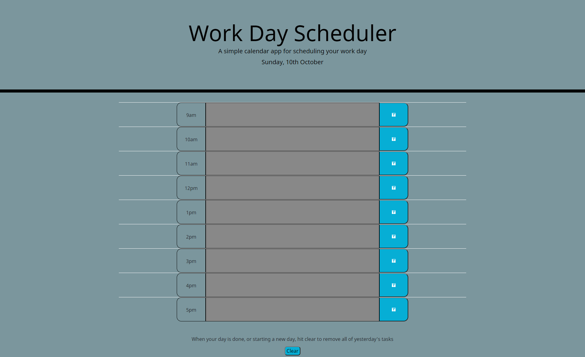

# Work day planner

## Description

Staying on track and on task can be difficult when there are 
competing priorities and a limited number of hours in the day. With a simple work day scheduler you can keep set your tasks out at the start of the day in convenient hour time blocks. At the start of the day you'll have the green zones to enter in your tasks, the red zone for the current hour block helping you stay on track, and the grey zones to let you know time has passed for those hours. 

To add a new entry all you have to do is type into the time block and hit the save button. At the end of the day, or at the start of the next day, hit the clear button at the bottom to remove all of the tasks and start fresh. 

## Screenshot

Screenshot of the Work day planner 

## Links

* Github repository for Work day planner https://github.com/RHJeffries/Work-day-planner

* Deployed Work day planner https://rhjeffries.github.io/Work-day-planner/

